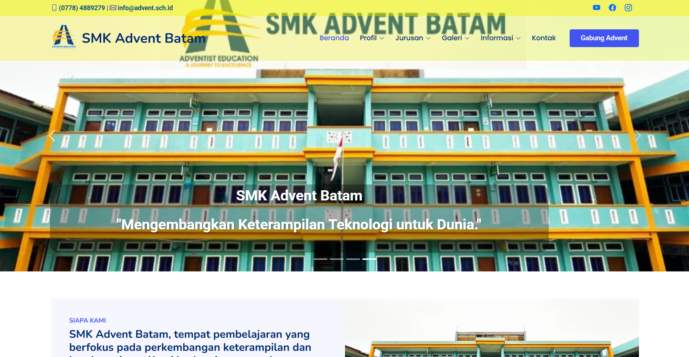

# Company Profile SMK Advent Batam

---

SMK Advent Batam Website is a web-based information system developed to serve as the school's official information and promotional platform while supporting the online student admission process. The website is designed to provide students, parents, and the public with quick and convenient access to school-related information.

Through this website, users can access information about the school's profile, study programs, facilities, school activities, photo galleries, and admission procedures. In addition, the website helps improve the quality of information services and supports digital transformation within the educational environment. This project was developed with a focus on usability, responsive design, and accessibility across various devices.

---

## 📸 Website Preview

---

## 🛠️ Tech Stack

- Frontend : HTML5, CSS3, JavaScript, Bootstrap
- Backend : PHP
- Database : MySQL
- Tools : Visual Studio Code, XAMPP

---

## 🚀 How to Run the Project

Download or clone this repository.
- Move the project folder to the htdocs directory in XAMPP.
- Import the database into MySQL using phpMyAdmin.
- Start Apache and MySQL from the XAMPP Control Panel.
- Open your browser and access:
  Example: http://localhost/smk-advent-batam
